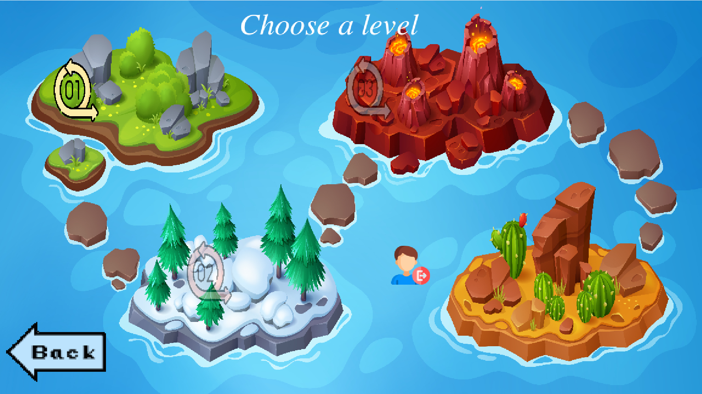

#
#  Precipitate Quest 
## Description

"Precipitate Quest" is an educational and interactive game designed to help students understand key chemistry concepts—such as chemical reactions, compounds, and solubility—in an engaging and accessible format. Players navigate through levels of increasing difficulty by solving chemistry-based tasks. Set in a virtual water pond, the game presents various compounds containing chemical impurities. To advance, players must choose the correct chemical reaction from multiple options to precipitate and remove these impurities, effectively purifying the water. Once purified, a bridge forms over the pond, allowing the character to progress.

To support players, the game provides a solubility chart they can consult when deciding on reactions, helping them understand which compounds will precipitate in water. Hints are also available to guide players through challenging scenarios, making learning approachable. Players earn points based on accuracy and speed and have a limited number of "lives" to encourage strategic thinking. As they advance through the three levels, each with unique backgrounds, animations, and interactive elements, students remain engaged and motivated to learn. 

"Precipitate Quest" aims to make chemistry concepts clear, enjoyable, and rewarding by creating an interactive and student-friendly learning experience.

## Expected Impact

The aim of "Precipitate Quest" is to provide students with an engaging, interactive platform to learn and apply fundamental chemistry concepts, such as chemical reactions and solubility, in a fun and accessible way. The game promotes deeper understanding through hands-on challenges, hints, and strategic gameplay elements.

## Gameplay

1. Go to [https://godotengine.org/download](https://godotengine.org/download) and download the latest version of Godot Engine for your operating system (Windows, macOS, or Linux).

2. Install Godot:
   - For Windows: Download the `.zip` file, extract it, and open `Godot.exe`.
   - For macOS: Download the `.dmg` file, drag Godot to the Applications folder, and open it from there.
   - For Linux: Download the `.tar.xz` file, extract it, and run `./Godot` from the terminal.

3. Open Godot and click **New Project** to create a project for "Precipitate Quest."

4. Launch the game and create an account or log in to save your progress.

5. After logging in, view the splash screen with the rulebook, gameplay instructions, logout button, and authors' credits.

6. Begin with Level 1, where you will encounter a contaminated water pond and need to choose the correct chemical reaction from three options to neutralize the impurities.

7. Use the Solubility Chart and hints if needed.

8. Each correct answer precipitates the impurity, forming part of a bridge across the pond. Correct answers trigger a success sound and earn points, while incorrect answers result in an error sound and loss of a life.

9. Complete Level 1 to unlock Level 2, which features more challenging questions and fewer hints.

10. Finish Level 2 to unlock Level 3, which has the most complex questions and new backgrounds.

11. After completing Level 3, a Game Over screen displays your score and achievements.

12. Choose to replay the game or log out to end your session.

## Screenshots

 
 

## Technologies Used

The game was developed using the following technologies:
- Godot 
- Piskel
- Firebase
- HTML
- CSS
- JavaScript
  
